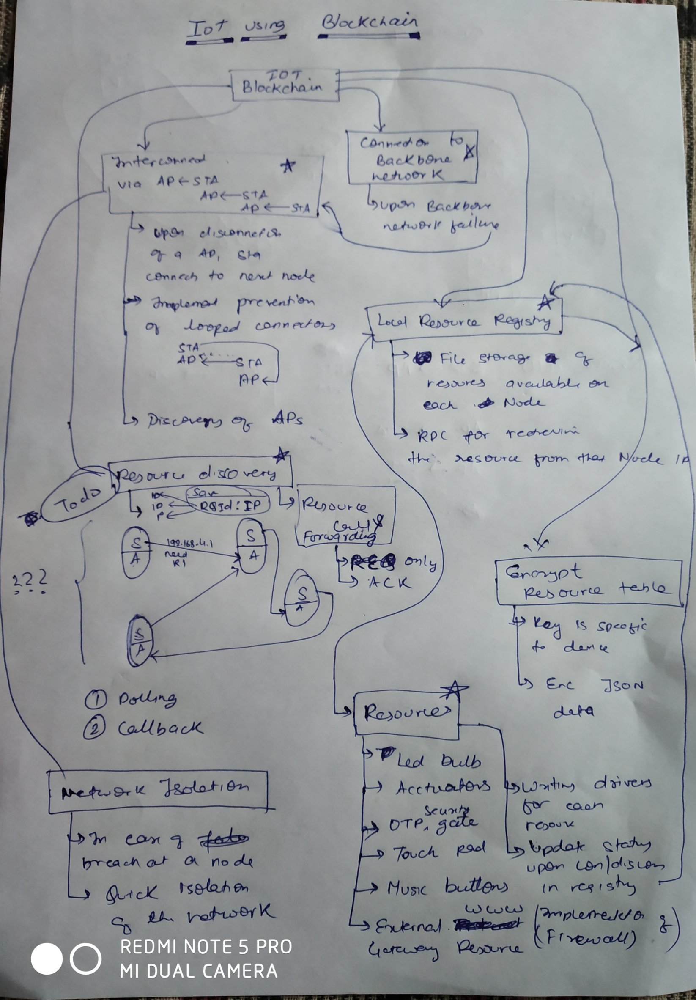
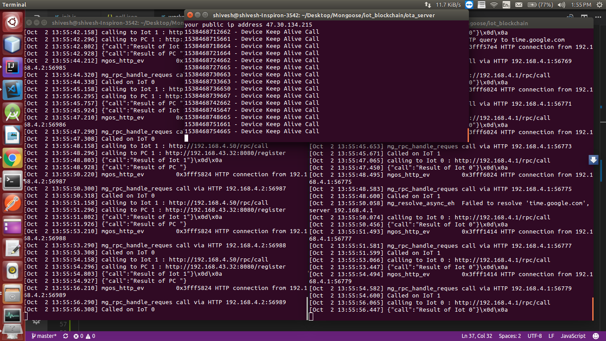

# iot_blockchain
College Minor project on Implementation of IoT using Blockchain

## Module 1: Resources 

### Capacitive Touch : IoT Potato Controlled Drum Player  ( 24/8/18 )
#### Demo Video : CLICK IMAGE TO OPEN 
[](https://www.youtube.com/watch?v=ghmBqej5D24 "Video : IoT Drum Player : Potato Version")

## Module 2: Resource Discovery 

### Internetwork Communication (CORE)  ( 02/9/18 )
To make HTTP calls from once device routed through AP and that Routed through STA mode when device is working in AP+STA mode . This will be used for Chaining Up multiple devices , request forwarding and Callbacking [See Test 2]


## Overview of Project

 

## Tests

### Test 1 : To check if a device is cabale of autoconnecting in sta mode when the AP is available   ( 01/9/18 )
#### Test Case 0 : 

After setting in config and device connects to AP , AP is restarted and device in monirotred if it rescans the AP and connects to it 
PASS

### Test 2 : To check if a device is cabale of requesting to servers on diffrent networks   ( 02/9/18 )
 

(Syntax = Stattion Name :> Access Point Name)
```code
iot_1 -----:> iot_0 ----:> wifi <:------ PC 
```
#### Test Case 0 : 

iot_1 makes an http call to iot_0  at a fixed IP and check if http call works  (PASS) 


#### Test Case 1 : 

iot_0 makes an http call to iot_1 (i.e. device in its AP network) at its guessed IP address (later IP table registration will be used ) and see if it gets resutls , this will be used in callbacking (PASS)


#### Test Case 2 : 

iot_0 makes an http call to PC (i.e. device in its STA Network) (PASS) 

#### Test Case 3 : 

```code
iot_1 <:-----:> iot_0  
```
Both devices are tightly coupled to each other i.e. connected to eachohers AP , but the ip addressing is in diffrerent ranges 

for iot_0 
```javascript

Cfg.set({wifi:{ap:{
  ssid:"iot_0",pass:"password",enable:true,ip:"192.168.4.1"
  ,gw:"192.168.4.1",dhcp_start:"192.168.4.2",dhcp_end:"192.168.4.49"}}});

```

for iot_1 
```javascript

    Cfg.set({wifi:{ap:{
ssid:"iot_1",pass:"password",enable:true,ip:"192.168.4.50"
,gw:"192.168.4.50",dhcp_start:"192.168.4.51",dhcp_end:"192.168.4.100"}}});

```

iot_0 makes an http call to iot_1 , iot_1 makes an http call to iot_0  (PASS) 

### Conclusions

In Image

````code

Top Terminal Shows Log on PC Endpoint
Left Terminal Shows Log on iot_0
Right Terminal Shows Log on iot_1

````


Idea is that when a device connected iot_0's AP makes a request to access PC (which is connected to same AP as iot_0) then iot_0 will recieve this request and make another request to PC , the result from the PC is required to be forwarded back to iot_1 which made the initial request thus facilitating callbacks

## Build It Yourself
 TODO
